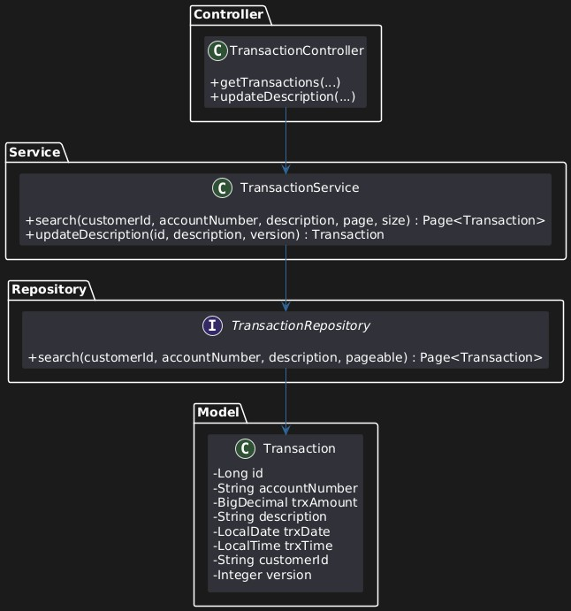

# Spring Batch File Processor & RESTful API

This is a Spring Boot project developed for a technical assessment. 
It processes a transaction data file using Spring Batch and exposes a RESTful API to retrieve and update transaction records.

---

## ^_^ Features

- ✅ **Spring Batch Job** to read a `.txt` file and store transactions into a database
- ✅ **RESTful API** to:
  - Retrieve transaction records with pagination and filtering
  - Update transaction description with **concurrency control**
- ✅ **H2 In-Memory Database** for development/testing
- ✅ **Unit Tests** with JUnit and Mockito

---

## Tech Stack

- Java 17
- Spring Boot 3.x
- Spring Batch
- Spring Data JPA
- H2 Database
- Lombok
- JUnit 5 + Mockito
- PlantUML for diagrams

---
## Diagrams
✅ Job Batch Diagram<br> 
✅ Controller-Service-Model Diagram<br> 
✅ Activity Diagram!<br> 

---

## How to Run

1. Clone the repo:
   ```bash
   git clone  https://github.com/ethancks/spring-batch-api-lab.git
   cd spring-batch-api-lab
2. Open in your IDE, or Git Bash application
3. Run the Spring Boot application:
    ```bash
    ./mvnw spring-boot:run
    ./mvnw clean install
4. Access H2 Console:   http://localhost:8080/h2-console
    ```bash
    JDBC URL: jdbc:h2:mem:testdb
    Username: sa
    Password: (leave empty)

---
## API Endpoints (to be added)
1. Search Transactions - customerId, accountNumber, description, page, size<br>
    ```bash
    curl -X GET "http://localhost:8080/transactions?customerId=222" -H "accept: application/json"
    curl -X GET "http://localhost:8080/transactions?customerId=222&description=ATM%20WITHDRWAL" -H "accept: application/json"

2. Update Transaction description - field `Version` must be match with DB entry
    ```bash
   curl -X PUT "http://localhost:8080/transactions/1?description=Updated+Note1&version=0"

---
## Running Tests
```bash
./mvnw test
```
Test coverage includes:
- Unit tests for Service layer
- Unit tests for Controller layer (MockMvc)
- Integration test for Batch job
- Concurrency conflict test for optimistic locking

---
## ✍️ Author
Ethan Chen

---
## 📄 License
This project is for educational and assessment purposes only.
